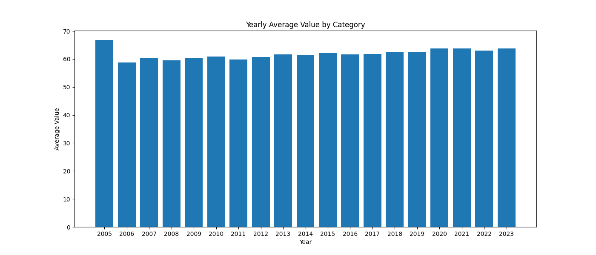

# Data Engineering Mini Project Three

[](https://github.com/nogibjj/Leonard_Eshun_Mini_Project_One/actions/workflows/workflow.yml)


This repository is created as an assignment from the Data Engineering course, IDS 706. The aim is to create a python project template that contains functioning placeholders for key python project best-practice elements.

The requirements are:

1. Python script using Polars for descriptive statistics.
1. Read a dataset (CSV or Excel)
1. Generate summary statistics (mean, median, standard deviation)
1. Create at least one data visualization


## This is what the python code does
It has six functions:

1. **load_dataset(dataset)** to load the dataset from a csv file. It fills mission values with zeros.
	```
	load_dataset(dataset: str) -> polars.DataFrame
	```
1. **get_summaries_per_country(dataset)** get statistics of the _"Healthy life expectancy at birth"_ grouped by country and sorts by country
	```
	get_summaries_per_country(dataset, a) -> polars.DataFrame
	```
1. **get_summaries_per_year(dataset)** get statistics of the _"Healthy life expectancy at birth"_ grouped by year and sorts by year
	```
	get_summaries_per_year(dataset, a) -> polars.DataFrame
	```
1. **get_average_per_year(dataset)** gets the mean of the _"Healthy life expectancy at birth"_ grouped by year. This is used for visualisation.
	```
	get_average_per_year(dataset, a) -> polars.DataFrame
	```
1. **get_country_per_year(dataset)** gets the time series of the _"Healthy life expectancy at birth"_ for each country from 2005 - 2023 and crucially finds missing years for each country and appends a record for that country with zero data (this could be improved later with a better derived data). This allows the data to be used on line or scatter charts. 
	```
	get_country_per_year(dataset, a) -> polars.DataFrame
	```	
1. **save_plot()** saves a bar chart to file to be displayed by markdown files.
	```
	save_plot()
	```
1. **save_summaries_to_markdown(data)** converts the summaries to markdown and saves them to file. This used with CI/CD.
	```
	save_summaries_to_markdown(data) -> str
	```


## Here are some of the results of the descriptive statistics

The full statistics can be found in [summary_statistics.md](summary_statistics.md)

### _Healthy life expectancy at birth Summaries by year:_
|    |   year |    Mean |   Median |   Std Deviation |   Maximum |   Minimum |
|---:|-------:|--------:|---------:|----------------:|----------:|----------:|
|  0 |   2005 | 66.8259 |  67.1    |         4.12903 |    72.4   |      53.2 |
|  1 |   2006 | 58.7279 |  62.28   |        13.1215  |    71.58  |       0   |
|  2 |   2007 | 60.3524 |  63.89   |        11.3298  |    72.64  |       0   |
|  3 |   2008 | 59.4758 |  62.62   |        13.1051  |    72.76  |       0   |
|  4 |   2009 | 60.3244 |  64.39   |        13.3291  |    72.88  |       0   |
|  5 |   2010 | 60.8879 |  64.85   |        13.3113  |    73     |       0   |
|  6 |   2011 | 59.85   |  63.93   |        13.5538  |    73.12  |       0   |
|  7 |   2012 | 60.7835 |  64.7    |        13.3913  |    73.24  |       0   |
|  8 |   2013 | 61.7337 |  64.82   |        11.3647  |    73.36  |       0   |
|  9 |   2014 | 61.3283 |  64.68   |        12.2697  |    73.48  |       0   |
| 10 |   2015 | 62.0535 |  65      |        11.1951  |    73.6   |       0   |
| 11 |   2016 | 61.6326 |  64.875  |        12.4865  |    73.725 |       0   |
| 12 |   2017 | 61.8412 |  64.75   |        12.2283  |    73.85  |       0   |
| 13 |   2018 | 62.531  |  64.975  |        11.0677  |    73.975 |       0   |
| 14 |   2019 | 62.3678 |  65.4    |        12.2428  |    74.1   |       0   |
| 15 |   2020 | 63.8468 |  66.225  |        11.649   |    74.225 |       0   |
| 16 |   2021 | 63.8012 |  66.225  |        11.5323  |    74.35  |       0   |
| 17 |   2022 | 62.9559 |  65.7625 |        12.2923  |    74.475 |       0   |
| 18 |   2023 | 63.771  |  65.95   |        11.0036  |    74.6   |       0   |


### _Bar chart for the Healthy life expectancy at birth_




## Steps taken to meet the requirements
The code was pushed to Github and Github Actions did the following main things:

1. Setup the virtual environment according to the parameters in the workflow.yml
1. Packages were installed, including those in the requirements.txt file
1. All python files were formated by black
1. Code linting was done
1. All the tests in the test_main.py were executed
1. Finally a markdown file was created and pushed to github automatically using CI/CD
