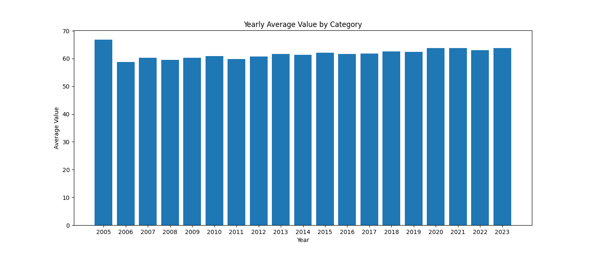

# Summary Statistics Grouped By Year
|    |   year |    Mean |   Median |   Std Deviation |   Maximum |   Minimum |
|---:|-------:|--------:|---------:|----------------:|----------:|----------:|
|  0 |   2005 | 66.8259 |  67.1    |         4.12903 |    72.4   |      53.2 |
|  1 |   2006 | 58.7279 |  62.28   |        13.1215  |    71.58  |       0   |
|  2 |   2007 | 60.3524 |  63.89   |        11.3298  |    72.64  |       0   |
|  3 |   2008 | 59.4758 |  62.62   |        13.1051  |    72.76  |       0   |
|  4 |   2009 | 60.3244 |  64.39   |        13.3291  |    72.88  |       0   |
|  5 |   2010 | 60.8879 |  64.85   |        13.3113  |    73     |       0   |
|  6 |   2011 | 59.85   |  63.93   |        13.5538  |    73.12  |       0   |
|  7 |   2012 | 60.7835 |  64.7    |        13.3913  |    73.24  |       0   |
|  8 |   2013 | 61.7337 |  64.82   |        11.3647  |    73.36  |       0   |
|  9 |   2014 | 61.3283 |  64.68   |        12.2697  |    73.48  |       0   |
| 10 |   2015 | 62.0535 |  65      |        11.1951  |    73.6   |       0   |
| 11 |   2016 | 61.6326 |  64.875  |        12.4865  |    73.725 |       0   |
| 12 |   2017 | 61.8412 |  64.75   |        12.2283  |    73.85  |       0   |
| 13 |   2018 | 62.531  |  64.975  |        11.0677  |    73.975 |       0   |
| 14 |   2019 | 62.3678 |  65.4    |        12.2428  |    74.1   |       0   |
| 15 |   2020 | 63.8468 |  66.225  |        11.649   |    74.225 |       0   |
| 16 |   2021 | 63.8012 |  66.225  |        11.5323  |    74.35  |       0   |
| 17 |   2022 | 62.9559 |  65.7625 |        12.2923  |    74.475 |       0   |
| 18 |   2023 | 63.771  |  65.95   |        11.0036  |    74.6   |       0   |

# Summary Statistics Grouped By Country
|     | Country name              |    Mean |   Median |   Std Deviation |   Maximum |   Minimum |
|----:|:--------------------------|--------:|---------:|----------------:|----------:|----------:|
|   0 | Afghanistan               | 52.7117 |  52.6    |        1.4957   |    55.2   |    50.5   |
|   1 | Albania                   | 68.5488 |  69.0125 |        0.77552  |    69.2   |    66.76  |
|   2 | Algeria                   | 66.1364 |  66.2    |        0.412972 |    66.7   |    65.5   |
|   3 | Angola                    | 52.15   |  52.15   |        0.800417 |    53.08  |    51.22  |
|   4 | Argentina                 | 66.7    |  66.84   |        0.478601 |    67.3   |    65.82  |
|   5 | Armenia                   | 65.8662 |  65.76   |        1.36126  |    68.2   |    63.84  |
|   6 | Australia                 | 70.5706 |  70.6    |        0.4219   |    71.2   |    69.8   |
|   7 | Austria                   | 70.4875 |  70.4625 |        0.572423 |    71.4   |    69.5   |
|   8 | Azerbaijan                | 62.5078 |  62.68   |        1.1245   |    64.1   |    60.58  |
|   9 | Bahrain                   | 65.655  |  65.7725 |        0.456871 |    66.2   |    64.76  |
|  10 | Bangladesh                | 62.75   |  63.54   |        1.88503  |    64.8   |    59.12  |
|  11 | Belarus                   | 63.4607 |  63.7    |        2.02434  |    66     |    60.06  |
|  12 | Belgium                   | 69.9412 |  70      |        0.8438   |    71.2   |    68.4   |
|  13 | Belize                    | 64.65   |  64.65   |        0.494973 |    65     |    64.3   |
|  14 | Benin                     | 54.5693 |  54.6    |        1.41643  |    56.7   |    51.96  |
|  15 | Bhutan                    | 62.42   |  62.42   |        0.179998 |    62.6   |    62.24  |
|  16 | Bolivia                   | 62.5    |  62.6    |        0.947753 |    63.9   |    60.9   |
|  17 | Bosnia and Herzegovina    | 67.1125 |  67.025  |        0.143178 |    67.4   |    67     |
|  18 | Botswana                  | 52.3168 |  52.58   |        1.82633  |    55     |    48.84  |
|  19 | Brazil                    | 64.6411 |  64.62   |        0.906431 |    66.1   |    63.1   |
|  20 | Bulgaria                  | 65.9253 |  66      |        0.558235 |    66.7   |    64.78  |
|  21 | Burkina Faso              | 53.0072 |  53.18   |        2.12186  |    56.4   |    49.44  |
|  22 | Burundi                   | 52.008  |  51.52   |        2.28082  |    55.2   |    49.66  |
|  23 | Cambodia                  | 60.25   |  60.53   |        1.48445  |    62.3   |    57.64  |
|  24 | Cameroon                  | 52.05   |  51.58   |        2.94057  |    57.2   |    47.84  |
|  25 | Canada                    | 71.0467 |  71.07   |        0.302266 |    71.5   |    70.5   |
|  26 | Central African Republic  | 43.374  |  42.84   |        1.59993  |    45.3   |    41.48  |
|  27 | Chad                      | 50.0172 |  49.93   |        1.95846  |    53.5   |    47.08  |
|  28 | Chile                     | 69.25   |  69.31   |        0.888455 |    70.6   |    67.78  |
|  29 | China                     | 67.525  |  67.74   |        1.0563   |    69     |    65.66  |
|  30 | Colombia                  | 68.1    |  68.19   |        1.06609  |    69.7   |    66.32  |
|  31 | Comoros                   | 58.1412 |  58.1025 |        1.14344  |    59.6   |    56.76  |
|  32 | Congo (Brazzaville)       | 55.2743 |  55.3875 |        1.54407  |    57.5   |    52.24  |
|  33 | Congo (Kinshasa)          | 52.365  |  52.15   |        2.04943  |    55.8   |    49.4   |
|  34 | Costa Rica                | 69.6    |  69.92   |        0.509672 |    70     |    68.56  |
|  35 | Croatia                   | 68.0763 |  67.9875 |        0.729496 |    69.3   |    66.94  |
|  36 | Cuba                      | 68      |  68      |      nan        |    68     |    68     |
|  37 | Cyprus                    | 71.75   |  71.7    |        0.901967 |    73.2   |    70.16  |
|  38 | Czechia                   | 68.3027 |  68.3    |        0.659601 |    69.3   |    67.1   |
|  39 | Denmark                   | 70.1878 |  70.39   |        0.974571 |    71.5   |    68.3   |
|  40 | Djibouti                  | 54.36   |  54.36   |        0.619678 |    55.08  |    53.64  |
|  41 | Dominican Republic        | 64.2    |  64.18   |        0.621952 |    65.36  |    63.2   |
|  42 | Ecuador                   | 67.15   |  67.33   |        1.59947  |    69.5   |    64.44  |
|  43 | Egypt                     | 62.3467 |  61.97   |        0.828933 |    64     |    61.4   |
|  44 | El Salvador               | 64.65   |  64.565  |        0.782868 |    66.3   |    63.5   |
|  45 | Estonia                   | 68.1176 |  68.3    |        1.37264  |    70.1   |    65.78  |
|  46 | Eswatini                  | 48.6    |  49.7    |        4.28797  |    52.5   |    42.5   |
|  47 | Ethiopia                  | 59.0309 |  59.1    |        1.64627  |    61.5   |    56.32  |
|  48 | Finland                   | 70.4425 |  70.7375 |        0.776341 |    71.3   |    68.72  |
|  49 | France                    | 71.6389 |  71.65   |        0.55215  |    72.5   |    70.7   |
|  50 | Gabon                     | 56.8462 |  56.95   |        1.41474  |    58.9   |    54.46  |
|  51 | Gambia                    | 57.24   |  57      |        0.776531 |    58.2   |    56.4   |
|  52 | Georgia                   | 64.2    |  64.15   |        0.595941 |    65.2   |    63.3   |
|  53 | Germany                   | 70.4489 |  70.09   |        0.598556 |    71.7   |    69.9   |
|  54 | Ghana                     | 56.15   |  56.28   |        2.19168  |    59.5   |    52.54  |
|  55 | Greece                    | 70.4812 |  70.4    |        0.542419 |    71.4   |    69.6   |
|  56 | Guatemala                 | 61.025  |  61.08   |        1.27682  |    63.1   |    58.98  |
|  57 | Guinea                    | 52.6538 |  52.4    |        1.42695  |    55.1   |    51.02  |
|  58 | Guyana                    | 56.24   |  56.24   |      nan        |    56.24  |    56.24  |
|  59 | Haiti                     | 39.7709 |  43.96   |       16.7877   |    55.5   |     6.72  |
|  60 | Honduras                  | 62.6044 |  62.5    |        0.961981 |    64.7   |    61.3   |
|  61 | Hong Kong S.A.R. of China |  0      |   0      |        0        |     0     |     0     |
|  62 | Hungary                   | 66.5506 |  66.6    |        0.832034 |    67.8   |    65     |
|  63 | Iceland                   | 71.8659 |  71.95   |        0.270018 |    72.1   |    71.2   |
|  64 | India                     | 58.8    |  58.92   |        1.77691  |    61.5   |    55.86  |
|  65 | Indonesia                 | 62      |  62.19   |        0.950588 |    63.3   |    60.32  |
|  66 | Iran                      | 65.7312 |  65.775  |        0.788973 |    66.9   |    64.3   |
|  67 | Iraq                      | 61.8507 |  60.94   |        1.36054  |    64.6   |    60.8   |
|  68 | Ireland                   | 70.6506 |  70.7    |        0.569039 |    71.5   |    69.62  |
|  69 | Israel                    | 71.9    |  71.76   |        0.605562 |    73     |    71.08  |
|  70 | Italy                     | 71.4944 |  71.55   |        0.484279 |    72.2   |    70.6   |
|  71 | Ivory Coast               | 53.775  |  53.9375 |        2.38747  |    57.1   |    48.9   |
|  72 | Jamaica                   | 66.6    |  66.6    |        0        |    66.6   |    66.6   |
|  73 | Japan                     | 73.5433 |  73.54   |        0.664533 |    74.6   |    72.4   |
|  74 | Jordan                    | 67.14   |  67.51   |        0.596104 |    67.6   |    65.8   |
|  75 | Kazakhstan                | 62.7    |  63.1    |        2.72699  |    66.6   |    58     |
|  76 | Kenya                     | 55.6    |  55.84   |        2.48766  |    59.3   |    51.42  |
|  77 | Kosovo                    |  0      |   0      |        0        |     0     |     0     |
|  78 | Kuwait                    | 69.6962 |  70      |        0.552536 |    70.2   |    68.4   |
|  79 | Kyrgyzstan                | 63.7    |  63.49   |        2.50296  |    67.9   |    59.92  |
|  80 | Laos                      | 59.1933 |  60.05   |        2.12682  |    61.7   |    55.88  |
|  81 | Latvia                    | 65.3059 |  65.8    |        1.15351  |    66.6   |    63.1   |
|  82 | Lebanon                   | 65.6933 |  65.67   |        0.368008 |    66.3   |    65.1   |
|  83 | Lesotho                   | 43.404  |  42.9    |        1.8241   |    46.15  |    41.52  |
|  84 | Liberia                   | 53.7109 |  53.1    |        1.90369  |    57.3   |    51.86  |
|  85 | Libya                     | 65.1081 |  65.0575 |        0.623405 |    66.1   |    64.3   |
|  86 | Lithuania                 | 65.5    |  65.2    |        1.44853  |    68.1   |    63.5   |
|  87 | Luxembourg                | 71.225  |  71.5    |        0.478387 |    71.7   |    70.3   |
|  88 | Madagascar                | 56.3008 |  56.3    |        1.22996  |    58.3   |    54.14  |
|  89 | Malawi                    | 53.7047 |  54.9    |        4.38988  |    59.3   |    45.36  |
|  90 | Malaysia                  | 65.5234 |  65.6125 |        0.219785 |    65.8   |    65.08  |
|  91 | Maldives                  | 69.775  |  69.775  |      nan        |    69.775 |    69.775 |
|  92 | Mali                      | 53.1071 |  53      |        1.90382  |    56.2   |    49.94  |
|  93 | Malta                     | 71.168  |  71.35   |        0.477869 |    71.7   |    70.22  |
|  94 | Mauritania                | 58.555  |  58.6    |        1.30422  |    60.7   |    56.5   |
|  95 | Mauritius                 | 63.85   |  63.8775 |        0.127932 |    63.975 |    63.52  |
|  96 | Mexico                    | 65.4422 |  65.73   |        0.463639 |    65.8   |    64.4   |
|  97 | Moldova                   | 62.75   |  62.71   |        2.07774  |    66.1   |    59.48  |
|  98 | Mongolia                  | 59.3375 |  59.95   |        1.33198  |    60.7   |    56.54  |
|  99 | Montenegro                | 66.6453 |  66.6    |        0.434345 |    67.4   |    65.96  |
| 100 | Morocco                   | 63.4046 |  63.5    |        0.522823 |    64.1   |    62.5   |
| 101 | Mozambique                | 48.7582 |  49.5    |        2.6984   |    52.2   |    44.82  |
| 102 | Myanmar                   | 60.335  |  60.4125 |        1.28948  |    62.2   |    58.16  |
| 103 | Namibia                   | 55.7183 |  56.1    |        1.76085  |    57.6   |    51.88  |
| 104 | Nepal                     | 60.6    |  60.17   |        0.893555 |    62.4   |    59.66  |
| 105 | Netherlands               | 71.1647 |  71.1    |        0.306709 |    71.7   |    70.7   |
| 106 | New Zealand               | 70.0129 |  69.9    |        0.253754 |    70.5   |    69.72  |
| 107 | Nicaragua                 | 65.1    |  65.15   |        0.473876 |    65.8   |    64.3   |
| 108 | Niger                     | 53.4094 |  53.44   |        2.08266  |    56.9   |    50.14  |
| 109 | Nigeria                   | 53.0312 |  53.2625 |        1.80583  |    55.7   |    50.22  |
| 110 | North Macedonia           | 65.605  |  65.4    |        0.714777 |    66.9   |    64.66  |
| 111 | Norway                    | 71.0308 |  71.3    |        0.691477 |    71.6   |    69.4   |
| 112 | Oman                      | 62.34   |  62.34   |      nan        |    62.34  |    62.34  |
| 113 | Pakistan                  | 55.6856 |  55.67   |        1.44999  |    58     |    53.2   |
| 114 | Panama                    | 68.0588 |  68.14   |        0.711389 |    69.1   |    66.86  |
| 115 | Paraguay                  | 65.4853 |  65.52   |        0.361233 |    66     |    64.88  |
| 116 | Peru                      | 68.5    |  68.67   |        1.18554  |    70.2   |    66.46  |
| 117 | Philippines               | 61.8    |  61.87   |        0.239301 |    62.1   |    61.36  |
| 118 | Poland                    | 67.9576 |  68      |        0.951283 |    69.4   |    66.2   |
| 119 | Portugal                  | 70.3162 |  70.5625 |        0.941746 |    71.5   |    68.34  |
| 120 | Qatar                     | 65.176  |  65.04   |        0.782739 |    66.4   |    64.36  |
| 121 | Romania                   | 66.1518 |  66.3    |        0.832015 |    67.3   |    64.5   |
| 122 | Russia                    | 62.35   |  62.48   |        2.19167  |    65.7   |    58.74  |
| 123 | Rwanda                    | 57.5708 |  58      |        2.18525  |    60.2   |    53.5   |
| 124 | Saudi Arabia              | 63.0889 |  63.1    |        1.0873   |    64.8   |    61.2   |
| 125 | Senegal                   | 58.05   |  58.05   |        1.60156  |    60.6   |    55.5   |
| 126 | Serbia                    | 66.4275 |  66.4625 |        0.643606 |    67.4   |    65.28  |
| 127 | Sierra Leone              | 50.4413 |  49.7    |        3.17324  |    56.1   |    46.28  |
| 128 | Singapore                 | 72.9213 |  73.11   |        0.795368 |    74     |    71.58  |
| 129 | Slovakia                  | 67.788  |  67.825  |        1.08166  |    69.4   |    65.62  |
| 130 | Slovenia                  | 70.0937 |  70.0875 |        0.837062 |    71.4   |    68.56  |
| 131 | Somalia                   | 48.0867 |  48.1    |        0.420159 |    48.5   |    47.66  |
| 132 | Somaliland region         |  0      |   0      |        0        |     0     |     0     |
| 133 | South Africa              | 52.9    |  53.65   |        3.91946  |    58.3   |    46     |
| 134 | South Korea               | 72      |  71.89   |        1.31107  |    74.2   |    70.02  |
| 135 | South Sudan               | 53.1012 |  53.0875 |        0.205359 |    53.35  |    52.88  |
| 136 | Spain                     | 71.5433 |  71.54   |        0.664533 |    72.6   |    70.4   |
| 137 | Sri Lanka                 | 65.5353 |  66.12   |        1.73966  |    67.4   |    62.28  |
| 138 | State of Palestine        |  0      |   0      |        0        |     0     |     0     |
| 139 | Sudan                     | 57.988  |  57.94   |        0.461649 |    58.66  |    57.46  |
| 140 | Suriname                  | 62.84   |  62.84   |      nan        |    62.84  |    62.84  |
| 141 | Sweden                    | 71.5478 |  71.38   |        0.439305 |    72.4   |    71     |
| 142 | Switzerland               | 72.1662 |  72.1    |        0.694761 |    73.3   |    71.16  |
| 143 | Syria                     | 63.0886 |  63.34   |        4.24212  |    68.62  |    56.3   |
| 144 | Taiwan Province of China  | 12.9637 |   0      |       27.8717   |    69.6   |     0     |
| 145 | Tajikistan                | 61.45   |  61.35   |        0.659545 |    62.6   |    60.5   |
| 146 | Tanzania                  | 55.95   |  56.37   |        3.02277  |    60.3   |    50.76  |
| 147 | Thailand                  | 67.7    |  67.91   |        0.717902 |    68.6   |    66.38  |
| 148 | Togo                      | 54.7217 |  54.95   |        2.52161  |    58.2   |    50.24  |
| 149 | Trinidad and Tobago       | 63.628  |  63.68   |        1.54548  |    65.7   |    61.78  |
| 150 | Tunisia                   | 66.708  |  66.75   |        0.279213 |    67.1   |    66.22  |
| 151 | Turkmenistan              | 61.288  |  61.54   |        0.771792 |    62.1   |    59.78  |
| 152 | Türkiye                   | 67.6411 |  67.62   |        0.906431 |    69.1   |    66.1   |
| 153 | Uganda                    | 55.15   |  55.88   |        3.62441  |    60.1   |    48.74  |
| 154 | Ukraine                   | 63.25   |  63.64   |        1.25854  |    64.8   |    60.92  |
| 155 | United Arab Emirates      | 65.625  |  65.475  |        0.541553 |    66.6   |    64.86  |
| 156 | United Kingdom            | 69.7467 |  69.67   |        0.426698 |    70.5   |    69.1   |
| 157 | United States             | 66.4    |  66.61   |        0.389684 |    66.78  |    65.6   |
| 158 | Uruguay                   | 67.3    |  67.46   |        0.254836 |    67.5   |    66.78  |
| 159 | Uzbekistan                | 63.6129 |  63.5    |        1.38908  |    65.9   |    61.34  |
| 160 | Venezuela                 | 64.8544 |  65.12   |        0.577812 |    65.5   |    63.7   |
| 161 | Vietnam                   | 64.9    |  64.86   |        0.476753 |    65.7   |    64.18  |
| 162 | Yemen                     | 58.0811 |  58.42   |        0.682944 |    58.72  |    56.6   |
| 163 | Zambia                    | 52.0471 |  52.7    |        2.98806  |    56.1   |    46.76  |
| 164 | Zimbabwe                  | 49.15   |  50.6    |        4.73276  |    55     |    40.4   |

# yearly_average

